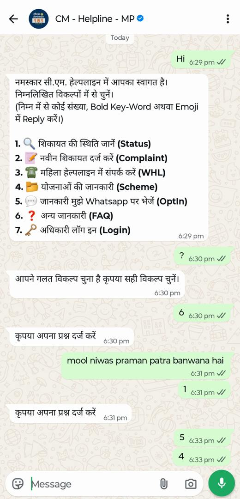
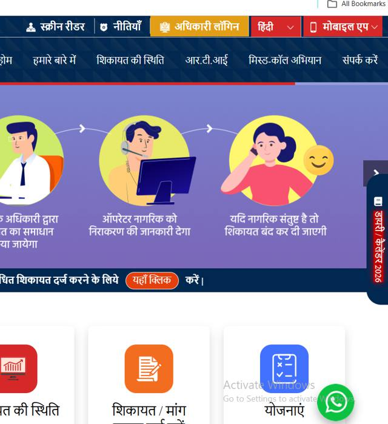

# Impact and Benefits

**Samadhan (समाधान)**

This note separates **what we measured**, **what the design guarantees**, and **what we cannot claim yet**.

## 1. Measured

| Measure | Result | How measured | Caveat |
|---|---|---|---|
| Department routing accuracy | About **90% exact** on 60 messages: hand-written 25 of 26, synthetic Bundeli/Malvi 29 to 30 of 34 | `backend/tests/prompt/run_routing_eval.py`, results in `submission/routing-eval-results-*.json` | One run per data set. Synthetic data was written by an LLM and not checked by native speakers. Remaining misses are mostly debatable labels |
| Water-issue extraction | 12 to 13 of 15 on the two best of six runs (11, 10, 9, 9, 13, 12) | `submission/T13-prompt-test-results-run*.json` | The 13/15 target was met once, not consistently |
| Automated tests | 415 backend + 35 dashboard tests pass; Ruff clean | `uv run pytest` | Tests use no network or keys; they check logic, not live accuracy |
| Definition-of-done scenarios | All ten exercised end to end with real providers; scenario 7 (GPS to the correct ward) cannot pass yet | Scripted run | Ward centre points are not available, so a GPS-only complaint goes to the district office |

## 2. Guaranteed by design (verifiable in the code and specs)

- **Fewer steps to file.** A citizen who gives everything in one message goes straight to confirmation. The minimum path is
  **describe → confirm → ticket**, two citizen messages (scenario 3 in `docs/PROJECT.md`). Missing details are asked one at a time.
- **No department knowledge needed.** The citizen never chooses a department or a form.
- **No typing needed.** Voice in, voice out.
- **No silent misrouting.** Low confidence goes to the district office as `needs_review`, and every officer correction is logged.
- **No duplicate tickets from retries.** A repeated message ID returns the stored answer.
- **Feedback for the citizen.** A complaint number, and status by typing or saying it.
- **Less triage work for officers.** Tickets arrive with a department, office, summary, audio and a review queue.

## 3. What we saw in an existing channel (CM Helpline on WhatsApp)

We tried the CM Helpline WhatsApp bot on 1 October 2026. It opens with a numbered menu of seven options: status, new complaint, women's helpline, schemes, opt-in, FAQ and officer login.

- The citizen has to pick a number. When we sent a "?", it replied that we had chosen a wrong option and asked us to choose again.
- After choosing the FAQ option, the bot asks the citizen to type the question. We typed a Hinglish question (*mool niwas praman patra banwana hai*). No answer came back in the chat, and the bot asked for the question again.
- There is no voice input, and the citizen must already know which of the seven menu options fits.

<table style="border:none"><tr>
<td style="border:none;width:48%"> <small>The CM Helpline WhatsApp bot: a numbered menu</small></td>
<td style="border:none;width:48%"> <small>The CM Helpline website, with its WhatsApp button</small></td>
</tr></table>

| | CM Helpline WhatsApp bot (our one test) | Samadhan |
|---|---|---|
| How the citizen starts | Pick a number from a menu of 7 | Describe the problem in their own words |
| Voice input | Not seen | Yes: press and hold, in Hindi or Hinglish |
| A free-text Hinglish question | No answer in our test | Understood and routed to a department |
| Must know the department | Must pick the right menu option | No |

This is one short test by our team, not a full evaluation, and we make no claim about the platform's overall performance. We did not count taps or typing time, so we do not give those numbers.

## 4. What we do not claim
- Any reduction in **resolution time**. That needs real usage over time, not a hackathon pilot.
- Statewide numbers, citizen counts, cost savings or call-centre load reduction. None have been measured.
- Dialect coverage beyond Hindi and Hinglish that a native speaker has confirmed.

## 5. Expected benefits at pilot scale (hypotheses to test, not results)
1. Fewer wrongly routed complaints, measured by the count of officer reassignments in `routing_corrections`.
2. Faster first response, measured by time from filing to first status change.
3. Less officer triage time, measured by time spent on the review queue.
4. Higher filing rate from citizens who avoid forms, measured by complaints filed by voice.
