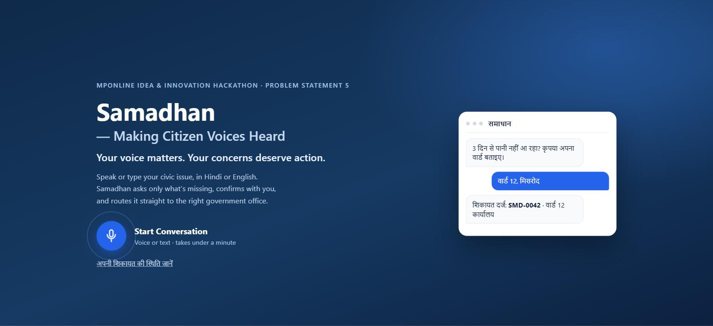
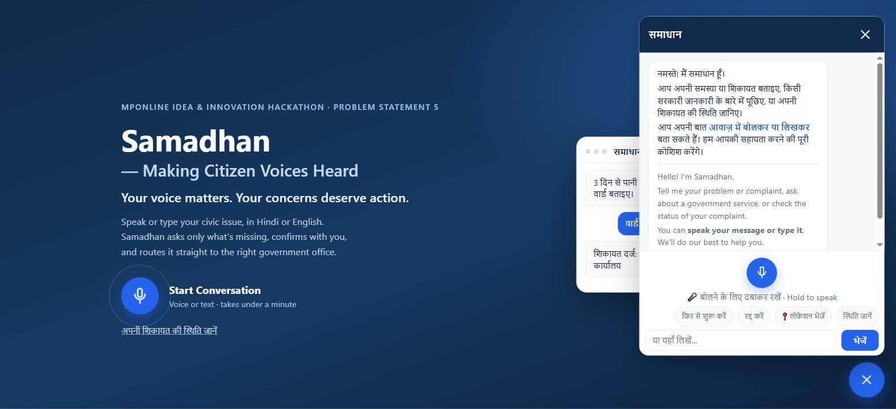

# Prototype, Demo and Proof of Concept

**Samadhan (समाधान) · MPOnline Idea & Innovation Hackathon 2026 · Problem Statement 5**

## Try it yourself (working prototype)
| | |
|---|---|
| **Live website** | [https://samadhan-web.onrender.com/](https://samadhan-web.onrender.com/) |
| **Source code** | [https://github.com/krishnakantnagina/Samadhan](https://github.com/krishnakantnagina/Samadhan) (tag `v1-mvp`) |
| **Officer dashboard** | [add the dashboard URL here if deployed] |
| **Demo video (optional)** | [add the video link here, or delete this row] |

The site runs on free hosting. If it has been idle, the first message can take up to a minute while the server wakes up.

## Try it in one minute
1. Open the live website and tap **Start Conversation**. The assistant greets you in Hindi (a recorded voice) and in English.
2. Type, or press and hold the mic and say: *"No water supply in my area for 3 days"* (Hindi also works, for example *"नल में पानी नहीं आ रहा"*).
3. Samadhan asks for the missing detail, the location. Tap the location button, or type a ward or village name, for example *Misrod*.
4. It shows a summary. Reply *yes* (or *हाँ*) to confirm.
5. You get a complaint number, `SMD-xxxx`. Tap **स्थिति जानें** (check status) to look it up, typed or spoken.

Try a different department (electricity, roads, sanitation) and an information question ("how do I get an income certificate?") to see the routing and the fixed, honest reply with an official link.

## Screenshots
**1. Home page: the citizen taps "Start Conversation"**

**2. The chat opens with a bilingual greeting, voice input, location and status buttons**

**3. A complaint conversation ending in a ticket number** — [screenshot to be added]

**4. The officer dashboard: tickets, review queue and map** — [screenshot to be added]

**5. The status page: complaint number lookup** — [screenshot to be added]

## What works today
- Hindi and Hinglish text and voice in; spoken replies out (Sarvam speech-to-text and text-to-speech, with a Groq Whisper fallback).
- One LLM call proposes the intent, department and fields. Plain code validates every value against a service specification file, so the model cannot invent a department or office.
- Five services on one engine: water, electricity, roads, sanitation and a general triage desk.
- Ticket `SMD-xxxx`, routed to a ward office, or to the district office marked `needs_review` when unsure.
- Officer dashboard: filters, ticket detail with the original audio, status changes, reassignment with an audit trail, review queue and map.
- Measured: about 90% exact routing on 60 test messages (synthetic dialect data); 415 backend and 35 dashboard automated tests pass.

## Honest limits
Office data for four of the five services is labelled DEMO; GPS does not yet choose a ward; there is no citizen phone verification or rate limiting yet; free-tier hosting and model limits can slow the first reply.
